# WebVote

WebVote is a web application that can provide online referendums or elections.
The app has three levels of privileges. Managers register users, admin creates a pool. Then voters vote. Finally admins and managers publish results.
Most of the user interface is responsive and looks good on mobile devices.
It was developed using [ASP.NET Core](https://github.com/dotnet/aspnetcore) and [Angular](https://angular.io/).

Self-hosted on my 10 y.o. PC using docker.

## Table of contents

- [About](#webvote)
- [Technologies](#technologies)
- [Demo](#demo)
- [Users' privileges](#users-privileges)
- [Poll](#poll)
- [User interface](#user-interface)
- [Analytic queries](#analytic-queries)
- [To-do](#to-do)

## Technologies

- Back-end
  - [ASP.NET Core](https://github.com/dotnet/aspnetcore)
  - [Entity Framework Core](https://github.com/dotnet/efcore)
  - [MariaDB](https://mariadb.org/)
  - [AutoMapper](https://automapper.org/)
  - [CsvHelper](https://joshclose.github.io/CsvHelper/)
  - [FluentValidation](https://fluentvalidation.net/)
- Front-end
  - [Angular](https://angular.io/)
  - [NG Bootstrap](https://ng-bootstrap.github.io/)
  - [FileSaver.js](https://github.com/eligrey/FileSaver.js)
- [Docker](https://www.docker.com/)

## Demo

[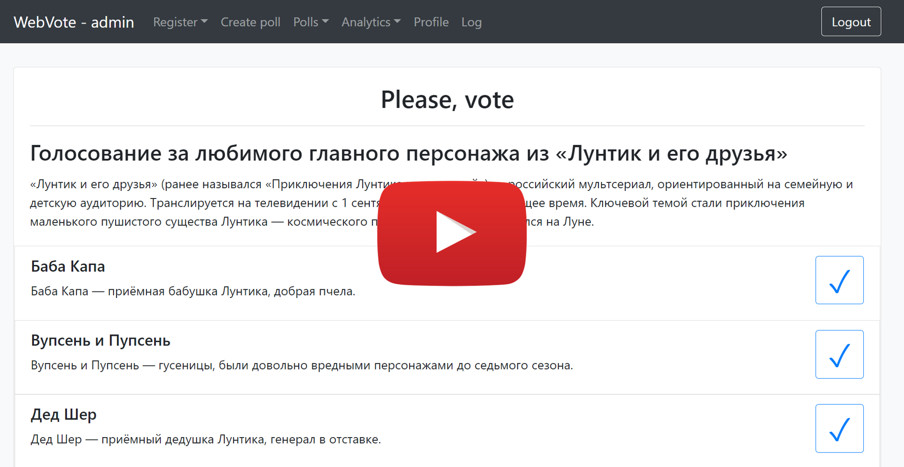](https://youtu.be/tJyB34bGs4s)

Check it now on webvote.tk

Voters:

```
for i in range(1, 200):
  login = i;
  password = i;
```

## Users' privileges

The system has three levels of user privileges (voter, manager, administrator).
Users with a higher level of privileges have access to all services, as do users with a lower level of privileges.

| Ability to                                                                | admin | manager | voter |
| ------------------------------------------------------------------------- | :---: | :-----: | :---: |
| [View active polls list](#active-polls-list)                              |   +   |    +    |   +   |
| [View archived polls list](##archived-pools-list)                         |   +   |    +    |   +   |
| [Vote on active polls](#vote-view-poll-form)                              |   +   |    +    |   +   |
| [View archived polls](#vote-view-poll-form)                               |   +   |    +    |   +   |
| [Change password](#profile)                                               |   +   |    +    |   +   |
| [Register a single voter](#registration-form)                             |   +   |    +    |       |
| [Request analytic queries](#analytic-queries)                             |   +   |    +    |       |
| [Export analytic queries as CSV](#analytic-queries)                       |   +   |    +    |       |
| [Register multiple voters via CSV](#registration-multiple-voters-via-csv) |   +   |         |       |
| [Create polls](#create-edit-poll-form)                                    |   +   |         |       |
| [View pending polls list](#pending-polls-list)                            |   +   |         |       |
| [Edit pending polls](#create-edit-poll-form)                              |   +   |         |       |
| [Delete pending polls](#pending-polls-list)                               |   +   |         |       |
| [View registration log](#registration-log)                                |   +   |         |       |

## Poll

A poll has a title, a description and a list of options.
Also, admin should specify date-time, when poll will start and date-time when poll will end.

An option has a title and a description.

### Poll states

1. Pending - poll that has not yet started. Can be deleted or edited by admin
2. Active - poll that already started and not yet ended. All users can vote
3. Archived - poll that already ended. All users can still view it. Admins and managers can view results

When user votes on active poll, it moves to archive (only for him)

## User interface

### Toolbars

There are three types of toolbars: **admin**, **manager**, **voter** and **unauthorized**

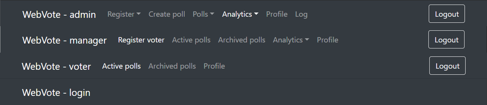

### Sign In form

Available to unauthorized users.

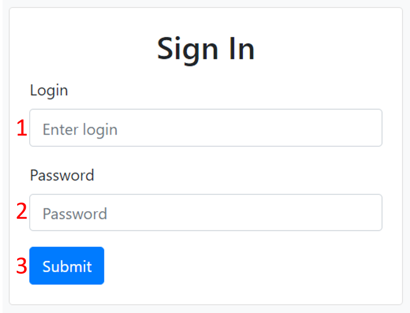

1. Login field
2. Password field
3. `Submit` button

### Registration form

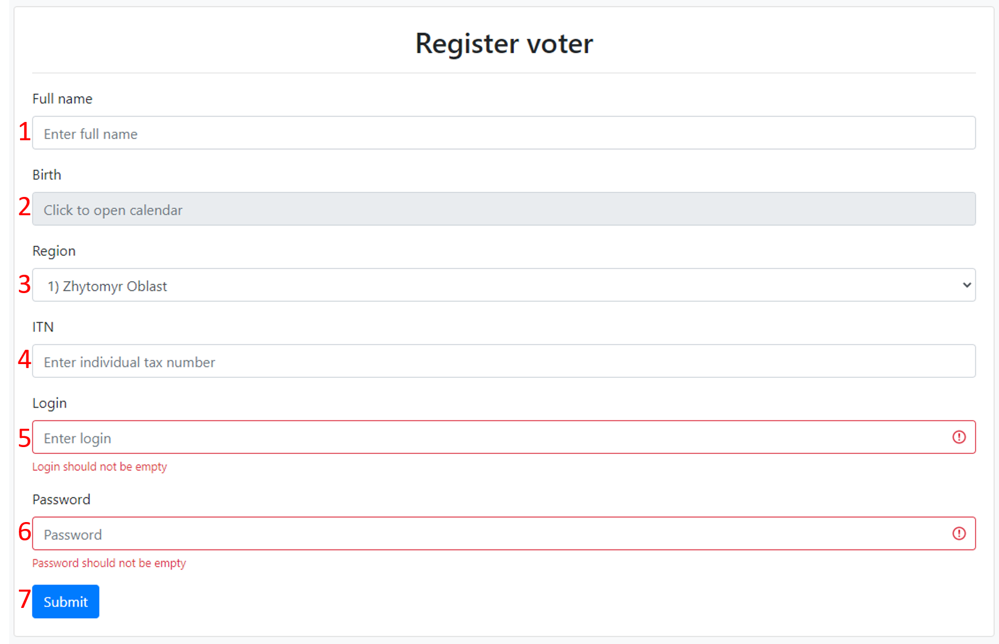

1. Full name field
2. Birth field
3. Region field
4. Individual tax number field
5. Login field
6. Password field
7. `Submit` button

### Profile

There is account info and ability to change password.

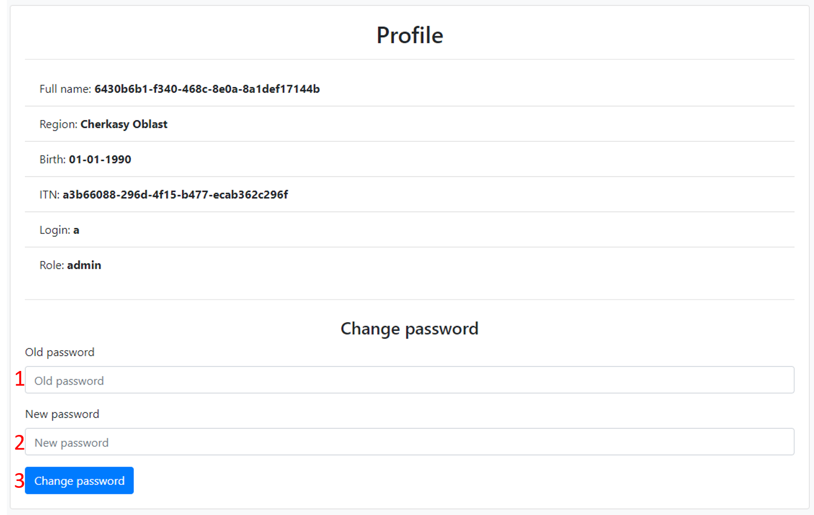

1. Old password field
2. New password field
3. `Change password` button

### Registration multiple voters via csv

If there are any errors in the file, they will appear under file input.

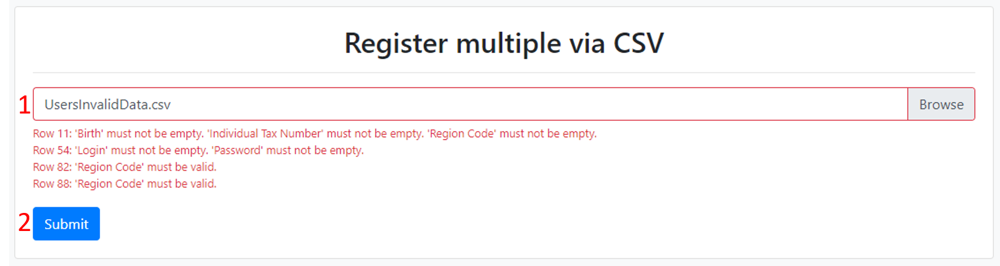

1. File input field
2. `Submit` button

### Pending polls list

Admin can delete or edit pending poll

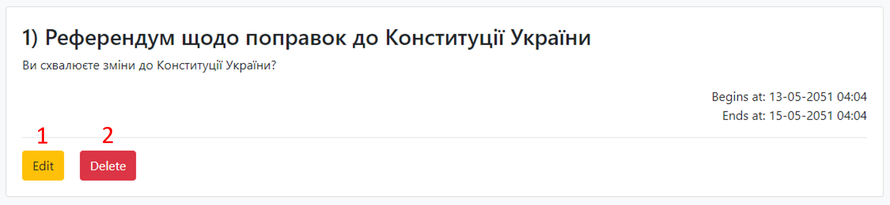

1. `Edit` poll button. Opens [edit form](#create-edit-poll-form)
2. `Delete` poll button. Deletes poll

### Active polls list

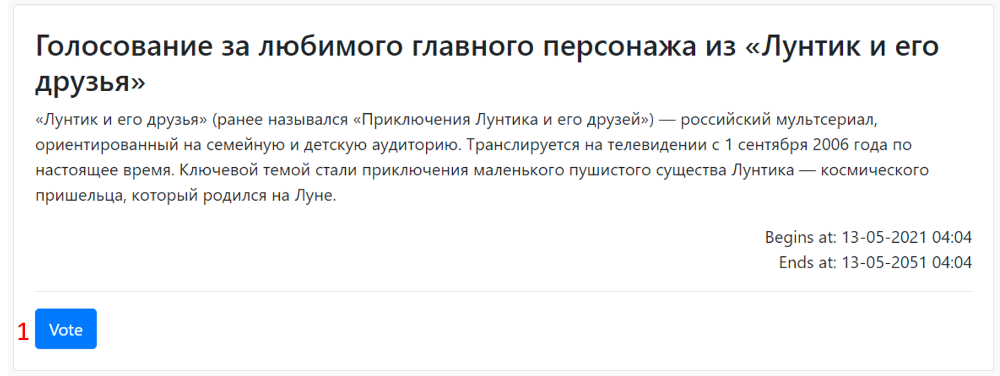

1. `Vote` button. Opens [vote form](#vote-view-poll-form)

### Archived pools list

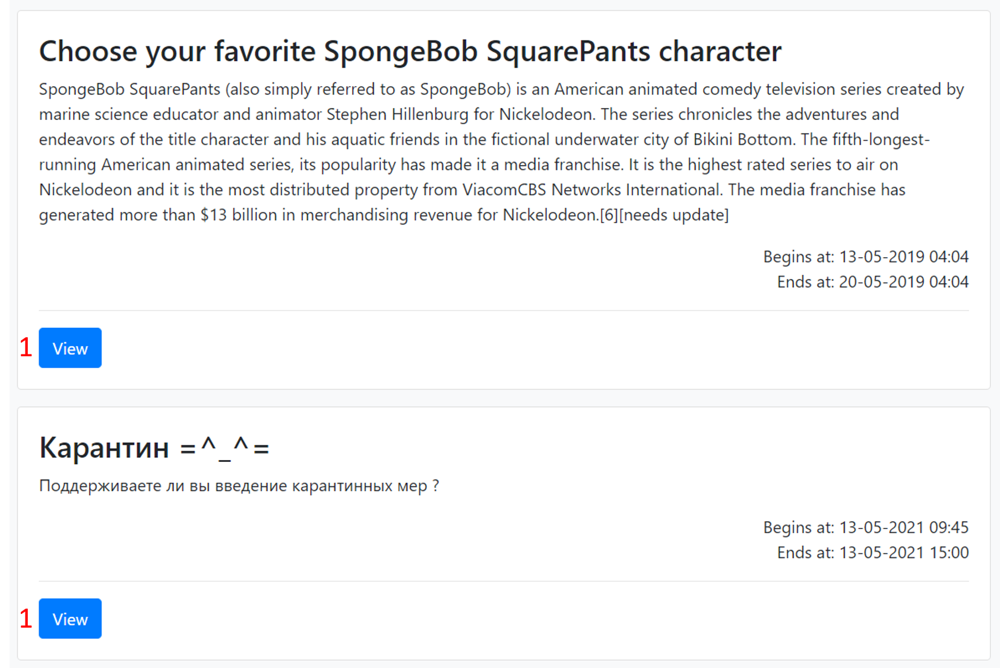

1. `View` button. Opens read only [vote form](#vote-view-poll-form)

### Create-edit poll form

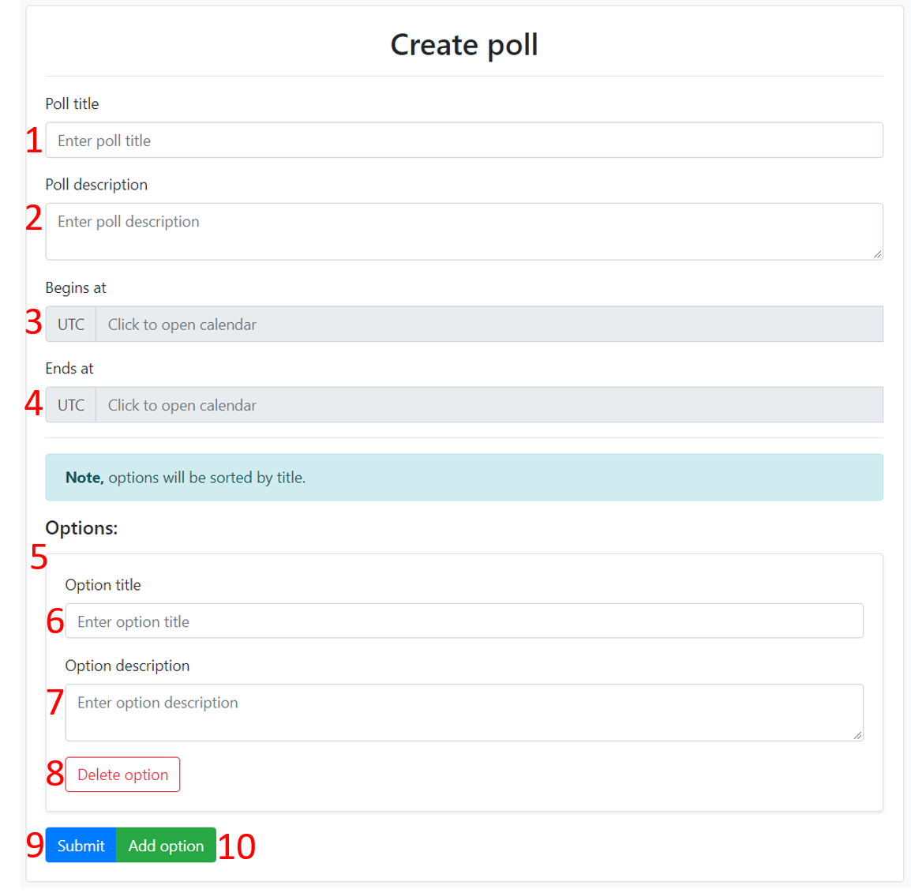

The similar form is used for editing polls.

1. Poll title field
2. Poll description field
3. Start datetime. Should be within one hour of the present
4. End datetime. Should be greater than start datetime
5. List of options. Number of options must be greater than 0
6. Option title field
7. Option description field
8. `Delete option` button
9. `Submit` button
10. `Add option` button

### Vote-view poll form

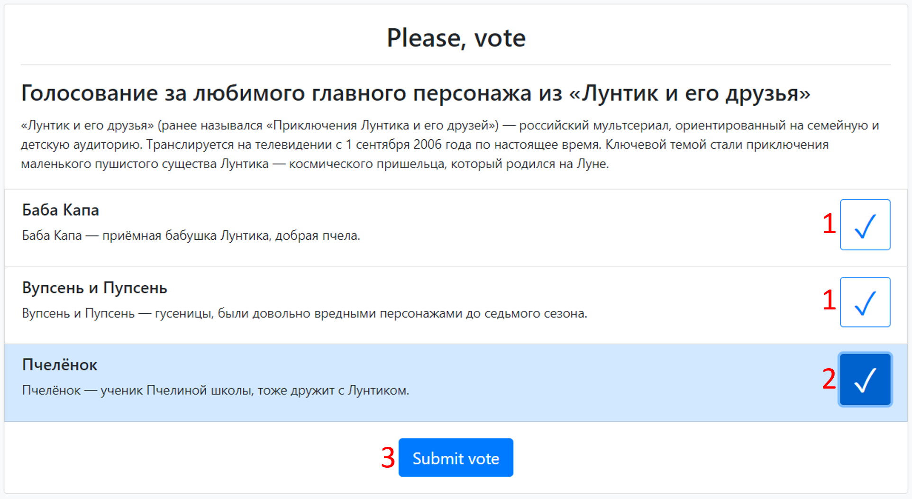

In the similar form for viewing poll, check marks and submit button are disabled.

1. Check mark. Selects an option
2. Highlighted check mark. Indicates that the option is selected
3. `Submit vote` button

### Registration log

Admin can view who was registered by whom and when

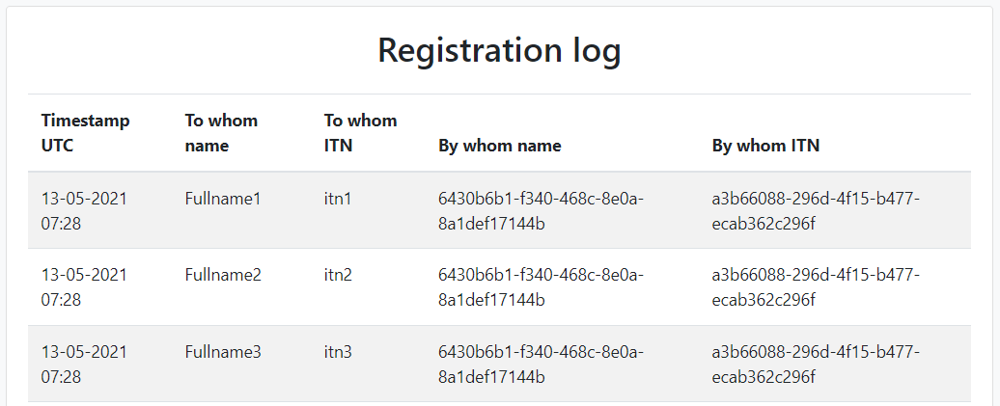

## Analytic queries

### Votes per option

Returns the number of votes per each option of the selected poll

- Option name
- Votes count
- Votes percent = votesCount / totalVotes \* 100%

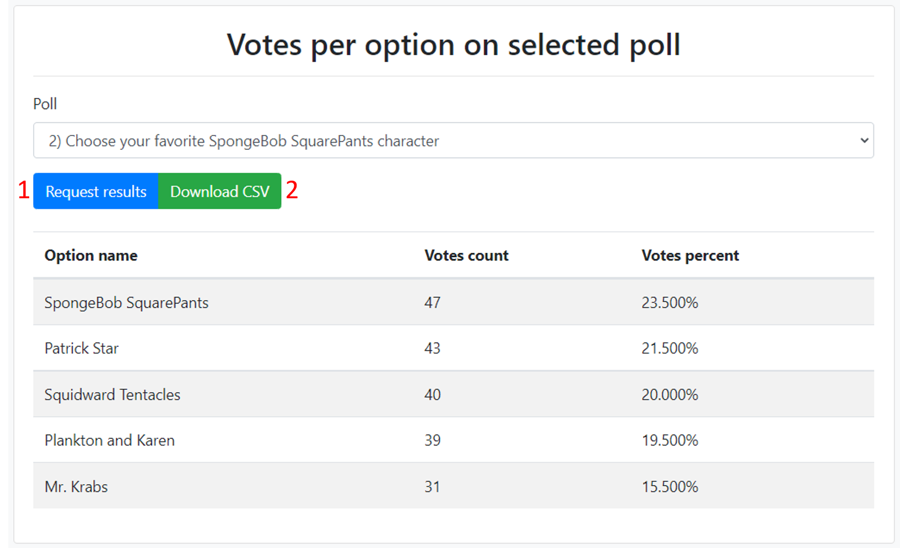

1. `Request result` button
2. `Download CSV` button. Starts downloading results as CSV file

```
Id,Title,Count,Percent
14,SpongeBob SquarePants,47,0.235
13,Patrick Star,43,0.215
8,Squidward Tentacles,40,0.2
11,Plankton and Karen,39,0.195
12,Mr. Krabs,31,0.155
```

### Votes per region

Returns the number of votes from each region of the selected poll. Can help you to see voters activity

- Region name
- Votes count
- Citizens count
- Voters activity = votesCount / citizensCount \* 100%
- Votes percent = votesCount / totalVotes \* 100%

_There is a bug in this query: the citizen count should be fixed at the moment the poll is completed, but it represents actual number of citizens_

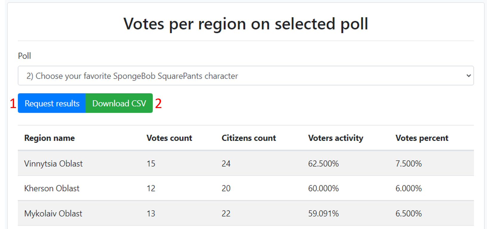

1. `Request result` button
2. `Download CSV` button. Starts downloading results as CSV file

```
Id,Name,VotesCount,CitizensCount,VotersActivityPercent,VotesPercent
5,Vinnytsia Oblast,15,24,0.625,0.075
16,Kherson Oblast,12,20,0.6,0.06
11,Mykolaiv Oblast,13,22,0.5909090909090909090909090909,0.065
12,Luhansk Oblast,13,22,0.5909090909090909090909090909,0.065
24,Cherkasy Oblast,12,21,0.5714285714285714285714285714,0.06
ETC...
```

## To-do

There are a couple things that I want to implement to make the system more consistent

1. Ability to change user privileges. Admin will be able to change other users' privileges
2. Ability to reset a password if user forgets it. Admin will be able to reset user's password
3. Ability to change user's personal information, for example region if user moves to another
4. Ability to link Google account to sign in with it
5. Ability to link email. To reset password with it and receive email notifications about new polls
6. Ability to attach files to polls, for example, some documents
7. Ability to attach photos to options. For example, photos of candidates in elections
8. Add more analytic queries
9. Cover all code with unit tests :wink:
10. CI / CD with GitHub Actions
